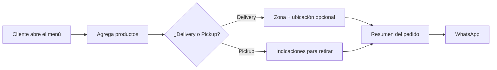
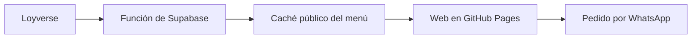
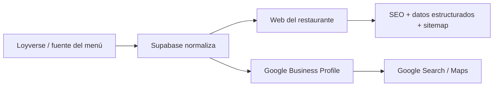
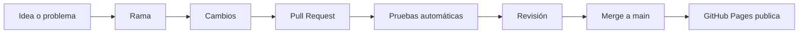

# Open Restaurant Menu

**Un menú web gratuito y open source para restaurantes que puede publicarse con GitHub Pages y enviar pedidos a WhatsApp.**

Está pensado para restaurantes pequeños, food trucks, cocinas de delivery y emprendimientos de comida que quieren una web útil sin empezar con una plataforma de comercio electrónico compleja.

> Puedes comenzar con **GitHub Pages + dos archivos editables**. Supabase y Loyverse son opcionales.

[🧪 Demo en vivo](https://javierbeargrill-afk.github.io/open-restaurant-menu/) · [🔥 Ejemplo real](https://menujaviergrill.store/) · [English](README.md) · [Guía para empezar](docs/GETTING_STARTED.md) · [Ecosistema](docs/ECOSYSTEM.md) · [Glosario](docs/GLOSSARY.md)

## ¿Qué hace este proyecto?

El cliente abre tu menú, agrega productos, elige **Delivery o Pickup**, puede compartir su ubicación y envía el pedido final a WhatsApp.



### Véalo funcionando

- **🧪 Demo interactiva:** úsala para probar carrito, Delivery/Pickup, ubicación y modo desarrollo sin afectar a un negocio real.
- **🔥 Implementación real:** [Javier Bear Grill](https://menujaviergrill.store/) es un restaurante en producción usando esta arquitectura mientras evoluciona.

> Javier Bear Grill es un negocio real. Para pruebas, utiliza la demo.

## Empieza simple

### Nivel 1 — Básico

```text
GitHub Pages
   ├── config/site.json   → datos del negocio
   └── data/menu.json     → productos y precios
              ↓
           Carrito
              ↓
           WhatsApp
```

Solo necesitas una cuenta de GitHub y un número de WhatsApp.

### Nivel 2 — Conectado



### Nivel 3 — Administrado

Agrega panel Admin, modo de pruebas, sincronización manual, horarios y configuración dinámica.

### Fase 2 — Google, SEO e indexación

La siguiente fase experimental busca usar la misma fuente del menú para mejorar la presencia del restaurante en Google sin mantener otro menú a mano.



Objetivos:

- sincronizar, cuando Google lo permita, productos, precios, descripciones y fotos con Google Business Profile;
- mantener la web preparada para SEO con HTML rastreable, Schema.org, canonical y sitemap;
- conectar Search Console para observar indexación y cobertura;
- evitar duplicar el mantenimiento entre POS, web y Google;
- mantener todo Google como módulo opcional.

Esta fase **todavía está en desarrollo**. Buscamos colaboración de personas con experiencia en **Google Business Profile APIs, Search Console, datos estructurados y SEO local para restaurantes**.

Más detalles: [Fase 2: Google](docs/GOOGLE-PHASE-2.md).

## Archivos que normalmente debes tocar

| Archivo | Para qué sirve |
|---|---|
| `config/site.json` | Nombre, horario, WhatsApp, delivery, pickup, colores |
| `data/menu.json` | Productos, descripciones y precios en modo básico |
| `sitemap.xml` | Dirección pública de tu web |
| `.env.example` | Lista de secretos que necesita el modo avanzado; nunca pongas valores reales ahí |

El resto del proyecto es el motor.

## Flujo de trabajo en GitHub



## ¿No entiendes una palabra técnica?

Consulta [docs/GLOSSARY.md](docs/GLOSSARY.md). Está escrito en lenguaje sencillo.

## Privacidad

El repositorio público puede contener código y datos públicos del negocio, pero nunca debe contener tokens, contraseñas, datos de clientes, direcciones privadas, costos internos ni información financiera.

Consulta [SECURITY.md](SECURITY.md).

## Licencia

MIT. Puedes usarlo, copiarlo, adaptarlo y mejorarlo.
