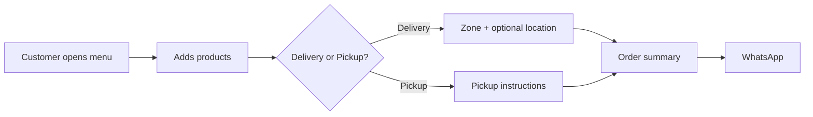
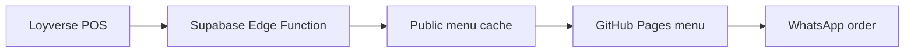
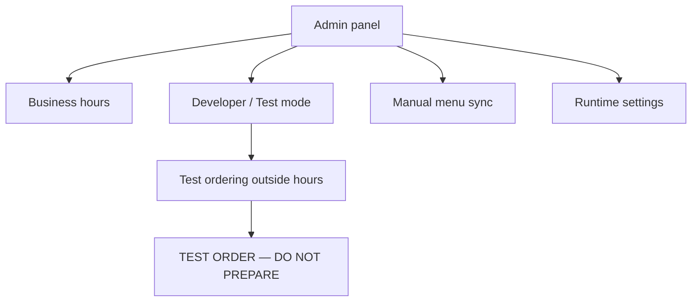
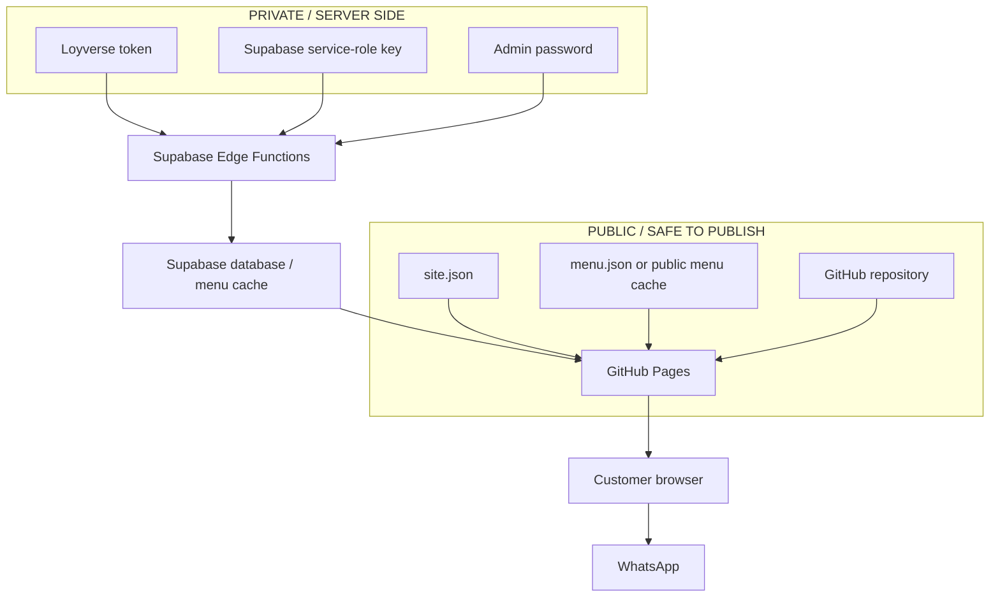
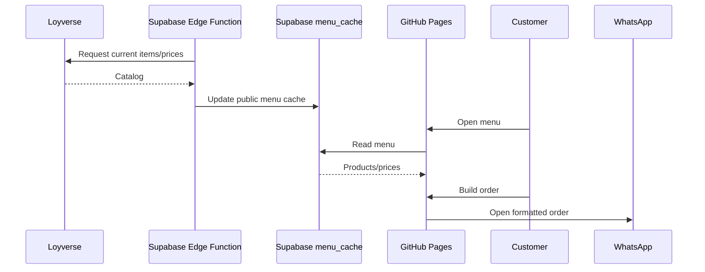
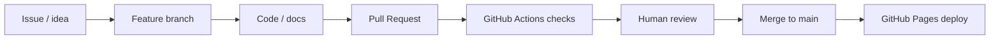

# Open Restaurant Menu

**A free, open-source restaurant menu you can publish with GitHub Pages and send orders to WhatsApp.**

Built for small restaurants, food trucks, delivery kitchens and home-based food businesses that want a real web menu without starting from a complex ecommerce stack.

> You can start with **just GitHub Pages + two editable files**. Supabase and Loyverse are optional upgrades.

[Live demo](https://javierbeargrill-afk.github.io/open-restaurant-menu/) · [Español](README.es.md) · [Beginner guide](docs/GETTING_STARTED.md) · [How the ecosystem works](docs/ECOSYSTEM.md) · [Glossary](docs/GLOSSARY.md)

---

## What does this project actually do?

A customer opens your menu, adds products to a cart, chooses **Delivery or Pickup**, optionally shares their location, and sends the finished order to your WhatsApp.



No ecommerce platform is required for the basic version.

---

## Start simple. Grow only when you need it.

### Level 1 — Basic

Best if you just want a menu online.

```text
GitHub Pages
   ├── config/site.json   → business settings
   └── data/menu.json     → products and prices
              ↓
         Customer cart
              ↓
           WhatsApp
```

**You need:** a GitHub account and a WhatsApp number.

### Level 2 — Connected

Best if your menu already lives in Loyverse.



Products and prices can be synchronized instead of edited manually.

### Level 3 — Managed

Adds a secure admin backend and operational tools.



Test mode lets you test ordering while the restaurant is closed **without changing the real schedule**.

---

## What can customers do?

- Browse menu categories.
- Search products.
- Add/remove quantities.
- Choose **Delivery** or **Pickup**.
- Select a delivery zone and fee.
- Share exact browser location for delivery.
- Choose a payment method.
- Add notes.
- See subtotal, delivery and total.
- Send the formatted order to WhatsApp.
- Be prevented from ordering outside configured business hours.

---

## What can the restaurant owner do?

In basic mode, edit a few configuration files in GitHub.

In advanced mode, the Admin panel can support:

- Real business hours.
- Developer/Test mode.
- Manual Loyverse synchronization.
- Menu status information.
- Runtime settings.
- Secure login through Supabase.
- Session-only test orders.

See [Admin & Developer Mode](docs/ADMIN.md).

---

## Do I need to be a developer?

**No for the basic setup.** Most restaurant owners only need to understand these files:

| File | What it controls | Usually edit it? |
|---|---|---:|
| `config/site.json` | Business name, hours, WhatsApp, delivery, pickup, colors | ✅ Yes |
| `data/menu.json` | Products, descriptions, prices | ✅ Yes in basic mode |
| `sitemap.xml` | Your published website address | ✅ Once |
| `.env.example` | Shows which private secrets advanced mode needs | ❌ Never put real secrets here |
| `index.html` | The application itself | Usually no |
| `supabase/` | Advanced backend, sync and admin | Only advanced installs |

For every setting in `site.json`, see [Configuration Dictionary](docs/CONFIGURATION.md).

---

## The ecosystem in one picture



**Rule of thumb:** code and public menu information can live on GitHub; passwords, POS tokens, private addresses and customer information cannot.

Read [Security](SECURITY.md) before connecting a real business.

---

## Quick start — basic version

1. Fork this repository.
2. Edit `config/site.json`.
3. Edit `data/menu.json`.
4. Put your GitHub Pages address in `sitemap.xml`.
5. Enable **Settings → Pages → Deploy from branch → main → / (root)**.
6. Open your new menu.
7. Test the complete order flow.

Detailed screenshots/checklist: [Getting Started](docs/GETTING_STARTED.md).

---

## Advanced setup — Loyverse + Supabase

Use this only when you need automatic menu synchronization or a secure admin backend.



Setup guide: [Ecosystem](docs/ECOSYSTEM.md) and [Architecture](docs/ARCHITECTURE.md).

---

## How development works on GitHub

Changes should normally follow this path:



This is important for real restaurants: **community code should be reviewed before it reaches production.**

Read [GitHub Workflow](docs/GITHUB-FLOW.md).

---

## Main folders

```text
open-restaurant-menu/
├── config/                  # Public restaurant configuration
│   └── site.json
├── data/                    # Static/basic menu
│   └── menu.json
├── docs/                    # Human-readable guides
├── scripts/                 # Validation/helper scripts
├── supabase/
│   ├── functions/           # Loyverse sync + secure admin API
│   └── migrations/          # Database setup
├── .github/
│   └── workflows/           # Automatic validation
├── index.html               # Web application
├── SECURITY.md
├── CONTRIBUTING.md
└── LICENSE
```

---

## I saw a technical word I do not understand

That's expected. Start with the [Plain-language Glossary](docs/GLOSSARY.md).

Examples:

- **Fork:** your own copy of this GitHub project.
- **GitHub Pages:** turns the repository into a public website.
- **Supabase:** optional backend/database.
- **Edge Function:** small server-side program that can safely use private secrets.
- **API:** a structured way for two systems to talk to each other.
- **RLS:** database rules controlling who can read/write data.
- **Pull Request:** a proposed change that can be reviewed before merging.

---

## Privacy by design

This project intentionally does **not** track installations or customer behavior by default.

Never commit:

- Loyverse tokens.
- Supabase service-role keys.
- Admin passwords.
- Customer names, phone numbers, addresses or orders.
- Private residential addresses.
- Internal recipes, costs, margins or financial records.

See [SECURITY.md](SECURITY.md).

---

## Community

If you use the project, you can optionally add your business to [ADOPTERS.md](ADOPTERS.md).

Useful contributions include:

- accessibility improvements;
- better mobile UX;
- translations;
- POS integrations;
- documentation;
- performance improvements;
- bug fixes.

See [CONTRIBUTING.md](CONTRIBUTING.md).

---

## License

MIT — use it, fork it, adapt it and improve it.

The goal is simple: **give small food businesses a useful web ordering foundation they can understand, own and improve.**
