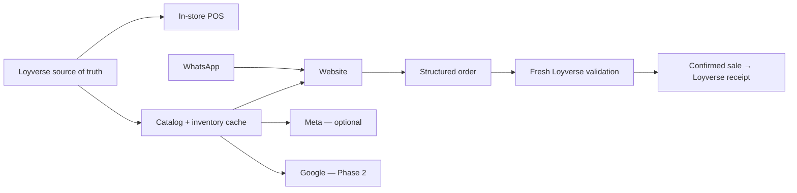

# Roadmap

Open Restaurant Menu grows in phases so the basic product stays understandable and useful even without advanced integrations.

## Phase 1 — Core ordering experience

Status: **working**

- GitHub Pages deployment.
- Public restaurant configuration.
- Static menu mode.
- Cart and WhatsApp handoff.
- Delivery and Pickup.
- Optional location sharing.
- Business-hours enforcement.
- Admin/Developer panel.
- Session-only Test mode.
- Optional Loyverse → Supabase menu synchronization.

## Phase 2 — Google discovery, SEO and menu distribution

Status: **in progress / experimental**

Goal: let the same restaurant data feed both the website and eligible Google surfaces, instead of maintaining separate copies manually.

Planned work:

- Google Business Profile API integration where supported.
- Food/menu synchronization for eligible restaurant profiles.
- Product photo/media synchronization or mapping.
- A stable image pipeline so changed photos can be detected and updated without unnecessary duplicate uploads.
- Search Console connection for sitemap submission and indexing/coverage visibility.
- Stronger Schema.org Restaurant/Menu structured data.
- Automatic sitemap/canonical generation for deployments.
- Local SEO documentation for restaurant owners.
- Clear sync logs, error states and last-success timestamps in the Admin panel.
- Safe one-product test mode before enabling full Google synchronization.
- Keep all Google integrations optional and isolated from the core ordering flow.

### Help wanted

We would especially welcome contributors with practical experience in:

- Google Business Profile APIs;
- restaurant FoodMenus/menu data;
- Google Business Profile media/photos;
- Search Console API;
- Schema.org Restaurant/Menu markup;
- local restaurant SEO;
- OAuth and Google API quota/approval workflows.

See [docs/GOOGLE-PHASE-2.md](docs/GOOGLE-PHASE-2.md).

## Phase 3 — Loyverse-centered omnichannel sales

Status: **active — production observation pilot**

Goal: make Loyverse the operational source of truth while keeping the first transactional rollout deliberately simple:

- in-store POS/tablet → Loyverse;
- restaurant website → validation → Loyverse;
- WhatsApp → communication/support and website handoff.

Meta and Google remain optional catalog/discovery adapters, not the authority that decides whether stock can be sold.

The current pilot architecture is:

Planned work:

- Treat Loyverse as the single source for products, variants/modifiers, prices, images and composite-item components.
- Keep Supabase as a cache/integration layer rather than a second master catalog.
- Observe real Loyverse webhooks and inventory behavior before automating sales.
- Reconcile real component-level stock after enabling inventory tracking.
- Add a website order intake path that does not depend only on a prefilled WhatsApp message.
- Keep Meta/WhatsApp catalog ordering optional; the first pilot uses the website as the digital transaction path.
- Create an order queue with states such as pending, accepted, rejected, paid/unpaid and completed.
- Revalidate item IDs, prices and availability before accepting online orders.
- Use Loyverse `RECEIPTS_WRITE` only for confirmed sales so abandoned chats do not become fake sales.
- Tag order source (`web`, `whatsapp`, etc.) for reporting when writing receipts.
- Investigate kitchen printer/KDS behavior for API-originated orders before promising automatic kitchen printing.
- If Loyverse cannot trigger kitchen output for API-created orders, design an optional local print/KDS bridge.
- Explore Meta Business Agent as an optional sales assistant, but never let the AI invent prices, stock or products outside the catalog.
- Preserve human handoff for unusual requests.

### Help wanted

Contributors with experience in the following would be especially useful:

- WhatsApp Business Platform / Cloud API;
- Meta Commerce catalogs and product feeds;
- WhatsApp catalog/product messages;
- Meta Business Agent;
- webhook reliability and message deduplication;
- Loyverse Receipts API and multi-channel POS integrations;
- kitchen printers/KDS and local print bridges;
- order-state design and payment reconciliation.

See [docs/PHASE-3-OMNICHANNEL.md](docs/PHASE-3-OMNICHANNEL.md).

## Later community milestones

- Easier one-click setup documentation.
- Optional image caching and optimization.
- More POS adapters beyond Loyverse.
- Internationalization and translation files.
- Accessible themes and custom branding packs.
- Optional analytics adapters that are disabled by default.
- Release/update notifications for production forks.
