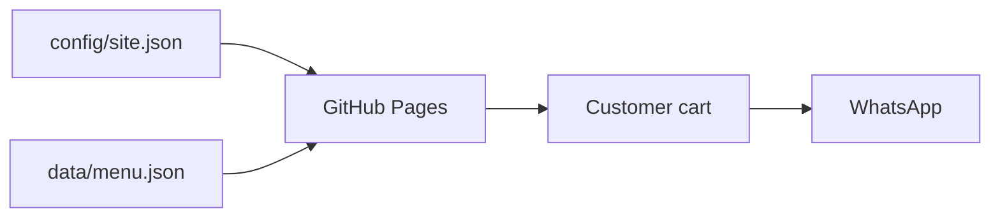
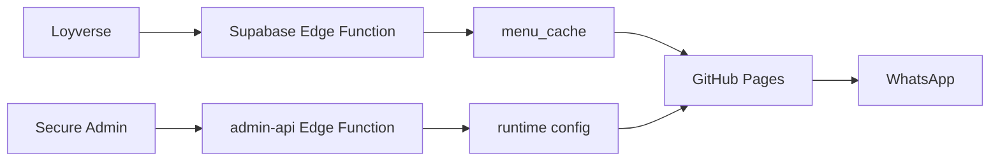
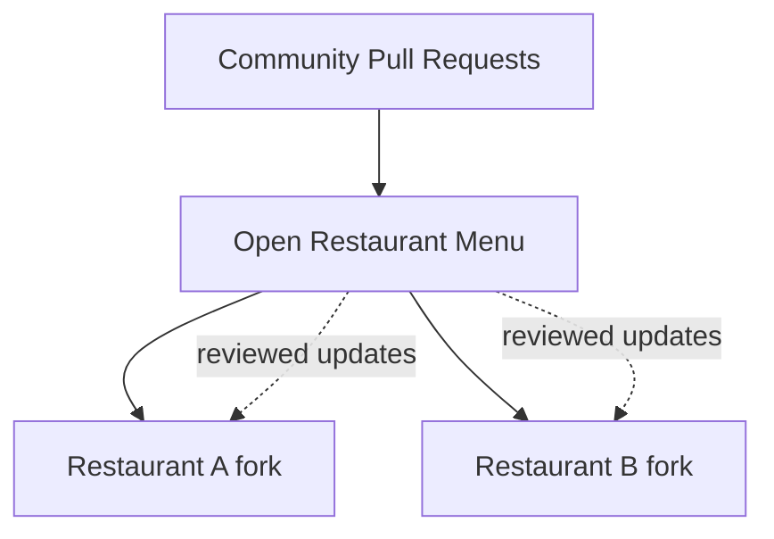

# Architecture

> New here? Read [GETTING_STARTED.md](GETTING_STARTED.md) first.  
> Want the big picture? Read [ECOSYSTEM.md](ECOSYSTEM.md).  
> Looking up a term? Read [GLOSSARY.md](GLOSSARY.md).

## Design goal

The architecture is intentionally progressive. A small restaurant should be able to use the basic version without knowing what a database or API is, while a more advanced installation can add synchronization and secure administration later.

## Basic mode

No backend is required.

## Advanced mode

The browser never needs the private Loyverse token or Supabase service-role key.

## Responsibility map

| Component | Responsibility |
|---|---|
| GitHub repository | Source code, documentation, version history |
| GitHub Pages | Public website hosting |
| `config/site.json` | Public restaurant settings |
| `data/menu.json` | Static/basic menu |
| Supabase database | Advanced public cache and runtime configuration |
| `loyverse-menu` Edge Function | Secure POS synchronization |
| `admin-api` Edge Function | Secure admin authentication/actions |
| WhatsApp | Final order handoff |
| GitHub Actions | Automated validation before deployment |

## Privacy boundary

### Public

- source code;
- public menu names and prices;
- branding;
- public business contact channels;
- public delivery zones;
- public pickup address when the restaurant chooses to publish one.

### Private

- POS tokens;
- service-role keys;
- admin credentials;
- customer records;
- invoices;
- internal recipes;
- costs and margins;
- internal inventory;
- private residential addresses.

## Community model

The reusable core lives here.

A restaurant creates its own fork/deployment, adds its own public configuration and private server-side secrets, and decides which upstream improvements to adopt.

Never auto-deploy unreviewed community code into a restaurant that is actively accepting orders.
