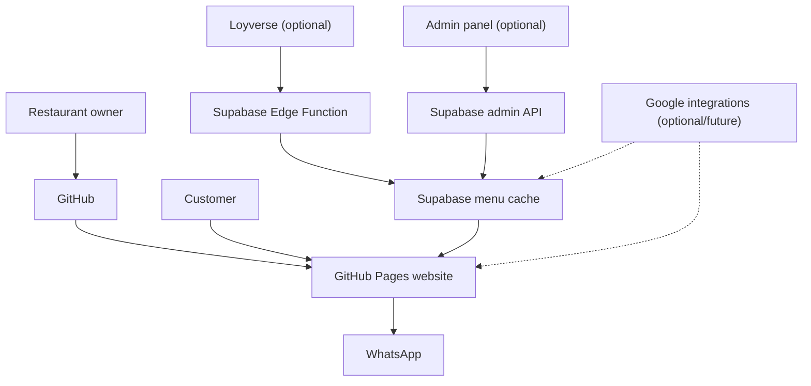
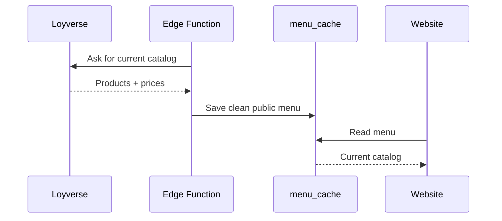
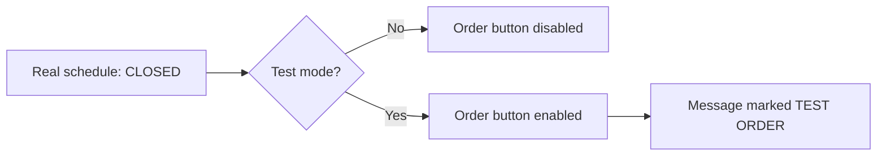
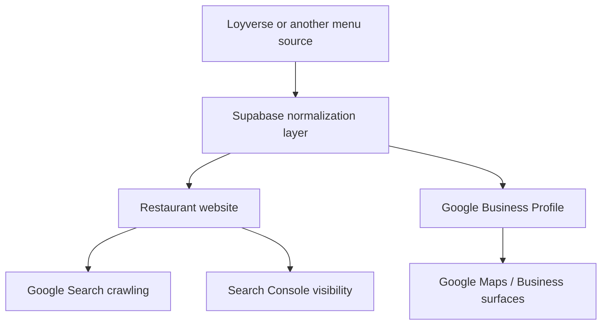

# The ecosystem — what every piece does

This document explains the complete project in plain language.

## The big idea

Open Restaurant Menu separates the system into small parts so a restaurant can use only what it needs.

## GitHub

### What it is here

GitHub stores the project's source code and history.

It also provides the workflow where improvements can be proposed, reviewed and merged.

### What GitHub should contain

- source code;
- public configuration;
- public menu data;
- documentation;
- database migrations;
- examples;
- automated validation.

### What GitHub should not contain

- passwords;
- access tokens;
- private customer data;
- private business addresses;
- secret keys;
- financial records.

## GitHub Pages

GitHub Pages turns the repository into the public restaurant website.

The browser runs the menu application directly.

## config/site.json

This is the restaurant's **public control panel in file form**.

It tells the frontend things like:

- business name;
- opening hours;
- currency;
- delivery zones;
- pickup availability;
- colors;
- WhatsApp number;
- whether hours are enforced;
- whether the menu comes from JSON or Supabase.

## data/menu.json

This is the menu source in basic mode.

It is simple, human-editable JSON.

## Supabase

Supabase is optional.

In advanced mode it provides:

- database tables;
- public menu cache;
- Edge Functions;
- secure admin sessions;
- runtime configuration;
- optional scheduled jobs.

## Loyverse

Loyverse is optional.

When connected, it becomes the main product/price source instead of editing `data/menu.json` manually.

## WhatsApp

WhatsApp is the final order handoff.

The project builds the order text in the customer's browser and opens WhatsApp with that message.

The basic project does not need to store customer data.

## Admin panel

The admin panel has two modes:

- **local-demo**: for public demo/testing only;
- **supabase**: for a real restaurant with server-side authentication.

## Developer/Test mode

Test mode solves a practical problem: how do you test a restaurant that is currently closed?

Instead of editing the real schedule, Test mode temporarily bypasses the schedule only in the current browser session.

## Google integrations — Phase 2

Google is intentionally optional. The core ordering system must continue to work even if no Google account or API is connected.

The Phase 2 idea is to avoid maintaining three separate copies of the same restaurant information.

### Intended responsibilities

**Website / SEO**
- crawlable menu content;
- Schema.org Restaurant/Menu markup;
- canonical URL;
- sitemap;
- fast public images;
- clear category/product information.

**Google Business Profile**
- keep eligible menu information aligned with the restaurant's source of truth;
- explore item names, descriptions, prices and photos where supported;
- avoid manual re-entry when a product changes.

**Search Console**
- observe crawl/indexing status;
- submit/refresh sitemap when appropriate;
- help diagnose discoverability problems.

### Important limitation

This is an experimental roadmap, not a promise that every Google Business Profile supports every menu/media capability. API access, account approval, category eligibility and Google product behavior may vary.

For that reason, implementation should start with a small controlled test before any full automatic synchronization.

See [GOOGLE-PHASE-2.md](GOOGLE-PHASE-2.md).

## What is mandatory?

| Component | Basic | Advanced |
|---|---:|---:|
| GitHub repository | ✅ | ✅ |
| GitHub Pages | ✅ | ✅ |
| `config/site.json` | ✅ | ✅ |
| `data/menu.json` | ✅ | Optional |
| WhatsApp | Recommended | Recommended |
| Supabase | ❌ | ✅ |
| Loyverse | ❌ | Optional |
| Google APIs | ❌ | Optional |

## Design principle

A beginner should be able to deploy the basic version without understanding databases, APIs or serverless functions.

Advanced integrations should be added progressively, not required from day one.
