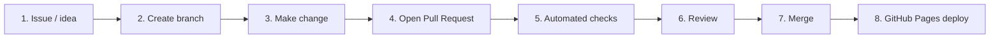
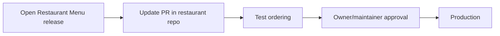

# GitHub workflow

This project treats `main` as the stable public version.

## Why not edit main directly?

A restaurant website may be live and accepting orders. A broken change in `main` can immediately affect customers after GitHub Pages deploys.

So meaningful changes should be tested first.

## Recommended flow

## Example

A contributor wants to add scheduled pickup times.

They create:

`feature/scheduled-pickup`

They implement it, update documentation and open a Pull Request.

GitHub Actions validates the project.

A maintainer reviews the behavior and security.

Only then is it merged into `main`.

## Production restaurants

A real restaurant should not automatically accept every upstream community change.

Recommended:

This gives the restaurant the benefits of community improvements without surrendering control of production.
