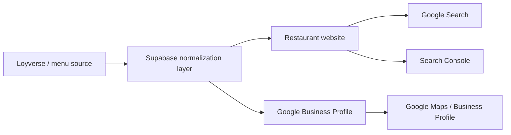
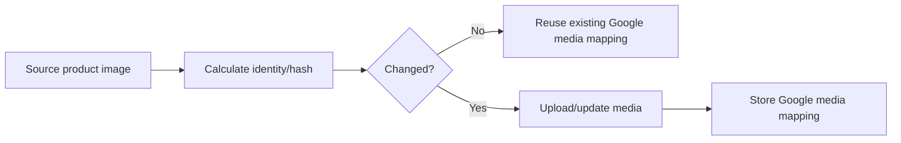
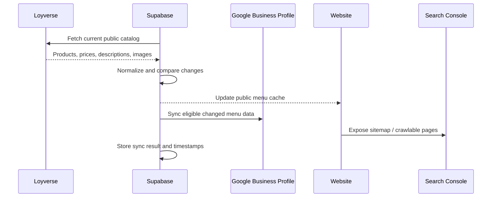

# Phase 2 — Google discovery, SEO and menu distribution

Status: **experimental / in progress**

The goal of Phase 2 is not merely to place a link on Google. The idea is to make the restaurant's existing menu data useful across the web and eligible Google surfaces without maintaining a second manual copy.

## Vision

One source of truth should be able to feed multiple public destinations.

## What we want to automate

### 1. Website SEO

The website should expose public menu content in a search-friendly form:

- crawlable HTML;
- clear Restaurant/Menu structured data;
- canonical URLs;
- sitemap.xml;
- useful titles and descriptions;
- stable image URLs;
- accessible category/product names.

### 2. Google Business Profile menu

Where the restaurant profile and Google API support it, explore synchronizing:

- menu sections/categories;
- item names;
- descriptions;
- prices;
- availability/status when appropriate;
- photos/media associated with menu items.

The exact Google capabilities and eligibility must be detected rather than assumed.

### 3. Product photos

A safe photo flow should avoid uploading the same image repeatedly.

Conceptually:

A synchronization table could track identifiers such as:

- source item ID;
- source image URL;
- image hash/version;
- Google media identifier;
- last successful sync;
- sync status/error.

No private credentials belong in GitHub.

## Search Console

Search Console is different from Business Profile.

Its role in this project is to help with discoverability diagnostics:

- verify the website;
- submit or refresh the sitemap where appropriate;
- observe indexing/crawl coverage;
- surface errors that prevent pages from being discovered.

Search engines still decide when and whether a page is crawled or indexed. The project should improve the technical signals, not claim guaranteed ranking or instant indexing.

## Proposed safe synchronization flow

## Rollout strategy

Do not enable full automatic Google sync on day one.

Recommended order:

1. Confirm API access and profile eligibility.
2. Read the current Google state.
3. Test one menu section or one item.
4. Verify name, price, description and photo behavior.
5. Record IDs/mappings so updates are idempotent.
6. Add dry-run/preview support.
7. Add Admin sync status and errors.
8. Only then enable broader scheduled synchronization.

## What is already available in the core

The current project already provides useful building blocks:

- Loyverse → Supabase synchronization;
- a public normalized menu cache;
- a web menu;
- structured SEO foundation;
- admin/developer tools;
- scheduled-job patterns;
- secret separation.

Phase 2 is intended to add Google adapters on top of these pieces rather than rewrite the core.

## Help wanted

This is a good area for expert community participation.

Useful experience includes:

- Google Business Profile APIs;
- restaurant menu/FoodMenus integrations;
- Google media/photo APIs;
- Search Console API;
- Google OAuth and API approval/quota workflows;
- Schema.org Restaurant/Menu;
- local restaurant SEO;
- sync/idempotency design.

Contributors are welcome to challenge the proposed architecture. A better reusable design is more valuable than copying one restaurant's implementation.

## Boundaries

- Google integration must remain optional.
- Never commit OAuth secrets, tokens or service credentials.
- Never hard-code one restaurant's Google account/location IDs into the reusable core.
- Do not claim guaranteed ranking or indexing.
- Production sync should have logs, error handling and a safe dry-run/test path.
