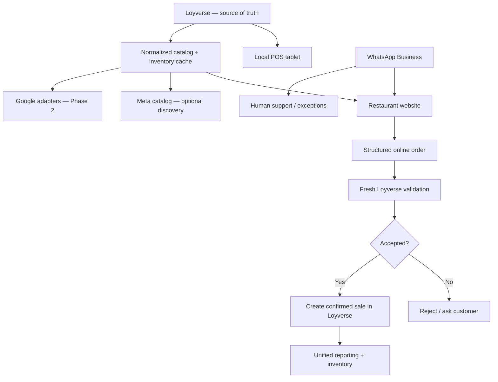

# Phase 3 — Omnichannel sales with Loyverse as the source of truth

Status: **active — Phase 3A observation mode**

## Phase 3A — observation mode (current)

Phase 3 starts by **observing before automating**.

The first implementation only receives and stores Loyverse webhook deliveries. It does **not** create receipts, reserve stock, change inventory, or modify the public menu.

This gives a real production dataset for questions that are difficult to answer safely from documentation alone:

- which webhook events actually arrive during normal restaurant operation;
- retry and duplicate behavior;
- batch sizes and timing;
- whether events arrive out of order;
- the shape of real payloads;
- how API-created receipts behave in later controlled tests.

For OAuth-created webhooks, the receiver verifies `X-Loyverse-Signature` against the raw request body. For Personal Access Token webhooks, which Loyverse documents as unsigned, the reference implementation requires a separate unguessable webhook secret.

### Inventory readiness

Inventory tracking is **optional for adopters**, but the first production pilot has now enabled Loyverse inventory tracking and rebuilt combo choices so selected sides/drinks can consume real inventory items instead of relying on non-stock modifiers.

That means Phase 3A can now observe real inventory behavior, including `inventory_levels.update` events.

Important guardrails remain:

- when `track_stock` is false, a zero level must not be interpreted as "sold out";
- imported/initial stock must be reconciled before the website automatically blocks sales;
- composite items and combo-choice helper items must ultimately consume the same leaf inventory that the kitchen actually uses;
- negative or unexpected initial balances are treated as data-quality signals to reconcile, not as proof that the architecture is wrong.

Automatic availability decisions come only after the observed Loyverse inventory matches physical operation closely enough to be trusted.

## Why this phase exists

A small restaurant, food truck or home kitchen should be able to sell from:

- the physical counter;
- a tablet running Loyverse POS;
- its own website;
- WhatsApp Business;

without maintaining separate product lists and prices in every place.

The project therefore treats **Loyverse as the operational source of truth**.

Supabase is an integration/cache layer. It can store normalized public data, sync state and online order state, but it should not become a second product catalog that drifts away from Loyverse.

## The target model

The production pilot intentionally keeps the transactional path simple: **local POS + website**. WhatsApp remains a communication/support channel, while Meta and Google are optional distribution/discovery adapters rather than transaction authorities.



This removes a second transactional menu from the critical path. If Meta/WhatsApp catalog updates lag, they cannot authorize a sale: the website/backend still revalidates against Loyverse before acceptance.

## Single source of truth

A product should have one master definition.

Examples of fields that should originate from Loyverse when supported:

- item ID / reference ID;
- name;
- description;
- category;
- variants;
- modifiers;
- selling price;
- image;
- taxes;
- availability;
- composite-item status;
- composite components / quantities.

Loyverse's API supports reading and writing items, categories, modifiers and composite items. Composite items can contain components and quantities, which makes them useful as a recipe/BOM-like structure for small food businesses.

## Local sales

The local workflow stays simple:

```text
Customer at counter
      ↓
Loyverse POS on tablet
      ↓
receipt / kitchen printer / KDS
      ↓
Loyverse sale + inventory
```

The project should not replace the POS where Loyverse already does the job well.

## Website sales

The current basic project hands a formatted order to WhatsApp.

Phase 3 should add an optional structured order path:

```text
Website cart
    ↓
Supabase order queue
    ↓
server validates current Loyverse IDs/prices
    ↓
restaurant accepts/rejects
    ↓
confirmed sale written to Loyverse
```

This allows online orders to become part of the same sales history as local POS sales.

The existing WhatsApp handoff can remain available as a simple/basic mode.

## Meta / WhatsApp — optional, not the transactional source

The production pilot does **not** require a WhatsApp catalog to take orders.

Preferred operational model:

```text
Customer conversation in WhatsApp
          ↓
restaurant website
          ↓
structured order
          ↓
fresh Loyverse validation
```

A Meta catalog may still be useful for advertising, recommendations or discovery, but its cached availability is not trusted as the final inventory decision.

WhatsApp remains useful for:

- customer questions;
- order clarification;
- human takeover;
- delivery coordination;
- sending the website/menu link.

If a future adopter wants structured WhatsApp ordering, it can plug into the same validated order queue later. It remains an optional adapter rather than a Phase 3 prerequisite.

## Writing sales back to Loyverse

Loyverse exposes a Receipts API that can create sales receipts.

That gives Phase 3 a possible path to unify online sales with POS reporting:

```text
accepted online order
    ↓
map product → Loyverse variant_id
    ↓
map payment/source
    ↓
POST receipt
    ↓
Loyverse receipt number
    ↓
store external ↔ Loyverse mapping
```

The integration should use idempotency/deduplication so one webhook retry cannot create two sales.

Recommended source labels:

- `web`
- `whatsapp`
- `meta-agent`

The exact field mapping and payment workflow must be tested against real Loyverse behavior before production use.

## Kitchen printing / KDS — important open question

Loyverse documents automatic kitchen printing and KDS behavior for tickets/orders created in the POS app.

That does **not** prove that a receipt created remotely through the API will trigger a local kitchen printer or KDS.

Do not promise this behavior until tested.

Possible outcomes:

### A. Native behavior works

If API-originated orders appear on the required kitchen workflow, use Loyverse directly.

### B. Native behavior does not work

Add an optional local bridge:

```text
accepted online order
      ↓
Supabase realtime/webhook
      ↓
small local device/app
      ├──→ kitchen printer
      └──→ local order screen
      ↓
confirmed sale remains in Loyverse
```

The bridge could run on a low-cost Android device, tablet, mini PC or other always-on device at the restaurant.

## Optional Meta Business Agent / AI

Meta has introduced Business Agent capabilities that can answer business questions, recommend products from a business catalog, qualify leads, close sales and allow human takeover.

The project should treat this as an **optional adapter**, not a dependency.

Rules for AI-assisted ordering:

1. The AI must read products/prices from the catalog/backend.
2. The AI must not invent items, prices, discounts or availability.
3. A structured order must be validated server-side before acceptance.
4. A human must be able to take over the conversation.
5. The final sale should be traceable to its source.
6. Customer data retention should be minimal and documented.

## One change, many channels

The intended user experience for the restaurant owner is:

```text
Change price in Loyverse
        ↓
sync layer detects change
        ├──→ website updates
        ├──→ Meta/WhatsApp catalog updates
        └──→ Google adapters update where supported
```

The restaurant owner should not need to remember to change the same burger in four systems.

## Data ownership model

| Data | Source of truth |
|---|---|
| Products / variants | Loyverse |
| Prices | Loyverse |
| Modifiers | Loyverse |
| Composite-item components | Loyverse |
| In-store sales | Loyverse |
| Confirmed web/WhatsApp sales | Loyverse after write-back |
| Temporary online order state | Supabase |
| Sync mappings/status | Supabase |
| Website presentation settings | `config/site.json` / runtime config |
| Google/Meta external IDs | Supabase mapping tables |

## Security requirements

- Loyverse, Meta and Supabase private tokens remain server-side.
- Browser code never receives service-role or permanent private API tokens.
- Incoming webhooks must be verified.
- Webhook retries must be deduplicated.
- Prices must be revalidated server-side at order acceptance.
- Do not trust product names/prices received from the browser as authoritative.
- Log external IDs and sync results without logging unnecessary personal customer data.
- Admin operations require authenticated server-side sessions.

## Suggested implementation stages

### 3.0 — Production observation — **starting now**

- Deploy the private webhook inbox.
- Receive real Loyverse events without changing operational data.
- Observe `items.update`, `inventory_levels.update` and receipt-related behavior.
- Measure retries, duplicates, event timing and payload shapes.
- Keep the existing human workflow as the safety layer.

### 3.1 — Inventory truth + catalog model

- Reconcile physical stock against Loyverse after the initial inventory migration.
- Map Loyverse item/variant IDs, composite items and reusable combo-choice components.
- Treat absolute Loyverse inventory as authoritative; never reconstruct stock from receipt deltas.
- Add sync/mapping tables and freshness timestamps.
- Do not block website sales from stock until observed inventory quality is reliable.

### 3.2 — Structured website order

- Website creates a server-side draft order.
- Re-read current Loyverse price/availability immediately before acceptance.
- Add accepted/rejected/conflict states.
- Preserve the current WhatsApp/manual flow as fallback during the pilot.

### 3.3 — Loyverse write-back

- Create one controlled test sale using the Receipts API.
- Verify totals, taxes, item mapping and inventory effects.
- Verify behavior when inventory is already insufficient.
- Store the project order UUID ↔ Loyverse receipt mapping.
- Add idempotent retry protection before real customer automation.

### 3.4 — Kitchen workflow

- Test whether API-originated sales trigger the required printer/KDS behavior.
- If not, prototype a minimal local bridge.

### 3.5 — Optional Meta / WhatsApp adapter

- Keep WhatsApp as communication/human support by default.
- Use Meta catalog for discovery/marketing where useful.
- Add structured WhatsApp ordering only for adopters that explicitly need it.

### 3.6 — Optional AI assistant

- Connect Meta Business Agent where available.
- Restrict responses/actions to validated catalog/order tools.
- Send purchase intent to the website/validated backend.
- Test human handoff and edge cases before enabling real ordering.

## Help wanted

Useful expertise:

- Loyverse API and restaurant POS workflows;
- WhatsApp Business Platform / Cloud API;
- Meta catalogs / Commerce product data;
- webhook verification and retry handling;
- Meta Business Agent;
- idempotent order processing;
- restaurant kitchen printers and KDS;
- offline/local print bridges;
- payment reconciliation.

## References

- Loyverse API: https://developer.loyverse.com/docs/
- Loyverse composite items: https://help.loyverse.com/help/how-create-composite-item
- Loyverse kitchen printers: https://help.loyverse.com/help/using-kitchen-printers
- Meta Business Agent announcement: https://about.fb.com/news/2026/06/meta-business-agent/
