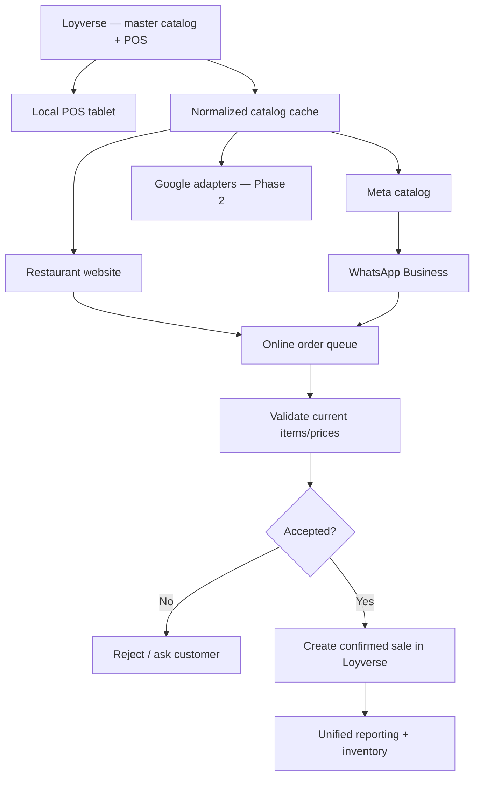
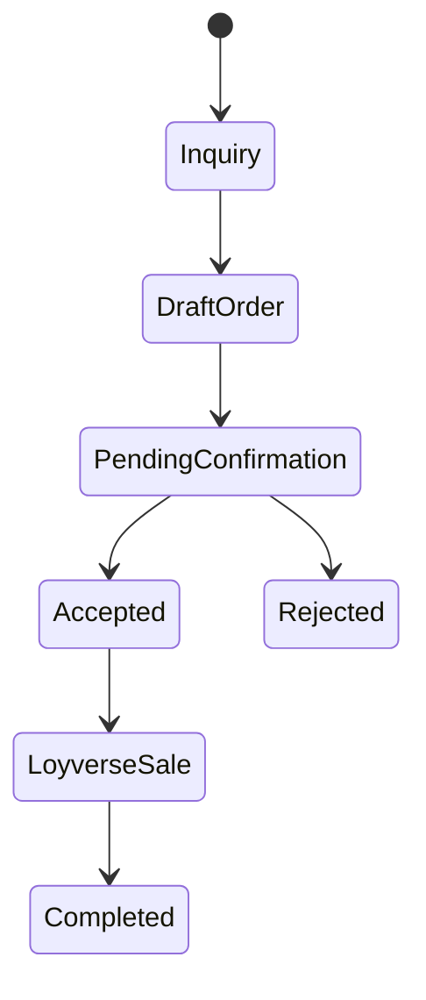

# Phase 3 — Omnichannel sales with Loyverse as the source of truth

Status: **planned / architecture in progress**

## Why this phase exists

A small restaurant, food truck or home kitchen should be able to sell from:

- the physical counter;
- a tablet running Loyverse POS;
- its own website;
- WhatsApp Business;

without maintaining separate product lists and prices in every place.

The project therefore treats **Loyverse as the operational source of truth**.

Supabase is an integration/cache layer. It can store normalized public data, sync state and online order state, but it should not become a second product catalog that drifts away from Loyverse.

## The target model



## Single source of truth

A product should have one master definition.

Examples of fields that should originate from Loyverse when supported:

- item ID / reference ID;
- name;
- description;
- category;
- variants;
- modifiers;
- selling price;
- image;
- taxes;
- availability;
- composite-item status;
- composite components / quantities.

Loyverse's API supports reading and writing items, categories, modifiers and composite items. Composite items can contain components and quantities, which makes them useful as a recipe/BOM-like structure for small food businesses.

## Local sales

The local workflow stays simple:

```text
Customer at counter
      ↓
Loyverse POS on tablet
      ↓
receipt / kitchen printer / KDS
      ↓
Loyverse sale + inventory
```

The project should not replace the POS where Loyverse already does the job well.

## Website sales

The current basic project hands a formatted order to WhatsApp.

Phase 3 should add an optional structured order path:

```text
Website cart
    ↓
Supabase order queue
    ↓
server validates current Loyverse IDs/prices
    ↓
restaurant accepts/rejects
    ↓
confirmed sale written to Loyverse
```

This allows online orders to become part of the same sales history as local POS sales.

The existing WhatsApp handoff can remain available as a simple/basic mode.

## WhatsApp Business catalog

The proposed catalog path is:

```text
Loyverse
   ↓
normalized catalog
   ↓
Meta catalog / Commerce layer
   ↓
WhatsApp Business catalog/product messages
```

The integration must preserve stable source IDs so an item updated in Loyverse can update the corresponding Meta product instead of creating duplicates.

Useful sync fields include:

- Loyverse item/variant ID;
- Meta catalog item ID;
- source update timestamp;
- image identity/hash;
- last sync timestamp;
- last result/error.

## WhatsApp orders

WhatsApp is a conversation channel, not automatically a sale ledger.

A safe design is:



Only an **accepted/confirmed** order should become a Loyverse sale.

This prevents abandoned chats, questions and incomplete carts from changing inventory or reports.

## Writing sales back to Loyverse

Loyverse exposes a Receipts API that can create sales receipts.

That gives Phase 3 a possible path to unify online sales with POS reporting:

```text
accepted online order
    ↓
map product → Loyverse variant_id
    ↓
map payment/source
    ↓
POST receipt
    ↓
Loyverse receipt number
    ↓
store external ↔ Loyverse mapping
```

The integration should use idempotency/deduplication so one webhook retry cannot create two sales.

Recommended source labels:

- `web`
- `whatsapp`
- `meta-agent`

The exact field mapping and payment workflow must be tested against real Loyverse behavior before production use.

## Kitchen printing / KDS — important open question

Loyverse documents automatic kitchen printing and KDS behavior for tickets/orders created in the POS app.

That does **not** prove that a receipt created remotely through the API will trigger a local kitchen printer or KDS.

Do not promise this behavior until tested.

Possible outcomes:

### A. Native behavior works

If API-originated orders appear on the required kitchen workflow, use Loyverse directly.

### B. Native behavior does not work

Add an optional local bridge:

```text
accepted online order
      ↓
Supabase realtime/webhook
      ↓
small local device/app
      ├──→ kitchen printer
      └──→ local order screen
      ↓
confirmed sale remains in Loyverse
```

The bridge could run on a low-cost Android device, tablet, mini PC or other always-on device at the restaurant.

## Optional Meta Business Agent / AI

Meta has introduced Business Agent capabilities that can answer business questions, recommend products from a business catalog, qualify leads, close sales and allow human takeover.

The project should treat this as an **optional adapter**, not a dependency.

Rules for AI-assisted ordering:

1. The AI must read products/prices from the catalog/backend.
2. The AI must not invent items, prices, discounts or availability.
3. A structured order must be validated server-side before acceptance.
4. A human must be able to take over the conversation.
5. The final sale should be traceable to its source.
6. Customer data retention should be minimal and documented.

## One change, many channels

The intended user experience for the restaurant owner is:

```text
Change price in Loyverse
        ↓
sync layer detects change
        ├──→ website updates
        ├──→ Meta/WhatsApp catalog updates
        └──→ Google adapters update where supported
```

The restaurant owner should not need to remember to change the same burger in four systems.

## Data ownership model

| Data | Source of truth |
|---|---|
| Products / variants | Loyverse |
| Prices | Loyverse |
| Modifiers | Loyverse |
| Composite-item components | Loyverse |
| In-store sales | Loyverse |
| Confirmed web/WhatsApp sales | Loyverse after write-back |
| Temporary online order state | Supabase |
| Sync mappings/status | Supabase |
| Website presentation settings | `config/site.json` / runtime config |
| Google/Meta external IDs | Supabase mapping tables |

## Security requirements

- Loyverse, Meta and Supabase private tokens remain server-side.
- Browser code never receives service-role or permanent private API tokens.
- Incoming webhooks must be verified.
- Webhook retries must be deduplicated.
- Prices must be revalidated server-side at order acceptance.
- Do not trust product names/prices received from the browser as authoritative.
- Log external IDs and sync results without logging unnecessary personal customer data.
- Admin operations require authenticated server-side sessions.

## Suggested implementation stages

### 3.1 — Catalog model

- Map Loyverse IDs, variants, modifiers and composite items.
- Add sync/mapping tables.
- Document which Loyverse fields are public vs internal.

### 3.2 — Meta catalog adapter

- Connect a test Meta catalog.
- Sync one product.
- Update its price/image.
- Verify no duplicate product is created.
- Expand to categories/catalog.

### 3.3 — Online order queue

- Website creates structured draft order.
- Validate against Loyverse.
- Add accepted/rejected states.
- Add source tracking.

### 3.4 — Loyverse write-back

- Create one test sale using the Receipts API.
- Verify totals, taxes, modifiers and reporting.
- Test inventory effects.
- Add deduplication.

### 3.5 — Kitchen workflow

- Test whether API-originated sales trigger the required printer/KDS behavior.
- If not, prototype a local bridge.

### 3.6 — WhatsApp Business

- Receive WhatsApp events through verified webhooks.
- Map catalog items to structured orders.
- Connect accepted orders to the same queue/write-back flow.

### 3.7 — Optional AI assistant

- Connect Meta Business Agent where available.
- Restrict responses/actions to validated catalog/order tools.
- Test human handoff.
- Audit edge cases before enabling real ordering.

## Help wanted

Useful expertise:

- Loyverse API and restaurant POS workflows;
- WhatsApp Business Platform / Cloud API;
- Meta catalogs / Commerce product data;
- webhook verification and retry handling;
- Meta Business Agent;
- idempotent order processing;
- restaurant kitchen printers and KDS;
- offline/local print bridges;
- payment reconciliation.

## References

- Loyverse API: https://developer.loyverse.com/docs/
- Loyverse composite items: https://help.loyverse.com/help/how-create-composite-item
- Loyverse kitchen printers: https://help.loyverse.com/help/using-kitchen-printers
- Meta Business Agent announcement: https://about.fb.com/news/2026/06/meta-business-agent/
