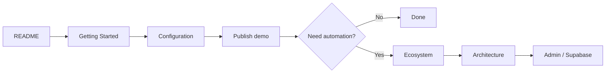

# Documentation map

You do not need to read everything.

| If you want to… | Read this |
|---|---|
| Put a restaurant menu online for the first time | [Getting Started](GETTING_STARTED.md) |
| Understand what GitHub, Supabase, Loyverse and WhatsApp each do | [Ecosystem](ECOSYSTEM.md) |
| Understand the technical structure | [Architecture](ARCHITECTURE.md) |
| Know what every `site.json` option means | [Configuration Dictionary](CONFIGURATION.md) |
| Use the Admin panel or Test mode | [Admin & Developer Mode](ADMIN.md) |
| Understand branches, PRs and deployments | [GitHub Workflow](GITHUB-FLOW.md) |
| Understand the planned Google/SEO integration | [Phase 2: Google](GOOGLE-PHASE-2.md) |
| Understand unified POS + web + WhatsApp sales | [Phase 3: Omnichannel](PHASE-3-OMNICHANNEL.md) |
| Look up a technical word | [Plain-language Glossary](GLOSSARY.md) |
| Contribute code or documentation | [Contributing](../CONTRIBUTING.md) |
| Understand privacy/security | [Security](../SECURITY.md) |

## Recommended reading order for beginners

The project is designed so that you can stop at **Done** and still have a useful restaurant menu.
